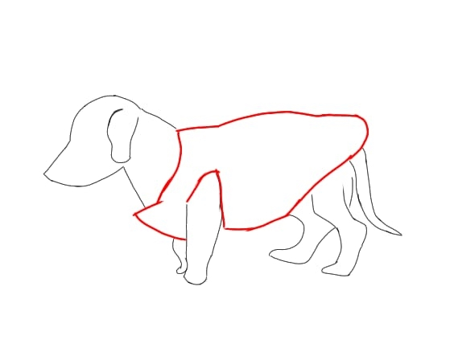

### Semana 9 - Do dia 04/04 ao dia 08/04
- Revisão da adição do componente GPS e criação do site para o uso do mesmo.

### Semana 10 - Do dia 11/04 ao dia 15/04
- Início da escolha específica dos modelos de cada componente;
- Decisão de não ultilizar o sensor GPS por ora, podendo ocorrer sua implementação futuramente no projeto, junto ao site.  
### Semana 11 - Do dia 18/04 ao dia 22/04
- Seleção final dos componentes a serem usados no projeto (sem a inclusão do sensor GPS, por agora);
- Calculo final de seus valores;
- Inicio de alterações na nova logo:

### Semana 11 - Do dia 25/04 ao dia 29/04
- Continuação da pesquisa de artigos relacionados ao tema, tanto da parte de embasamento teórico quanto de embasamento técnico;
- Continuação de alterações da logo:

