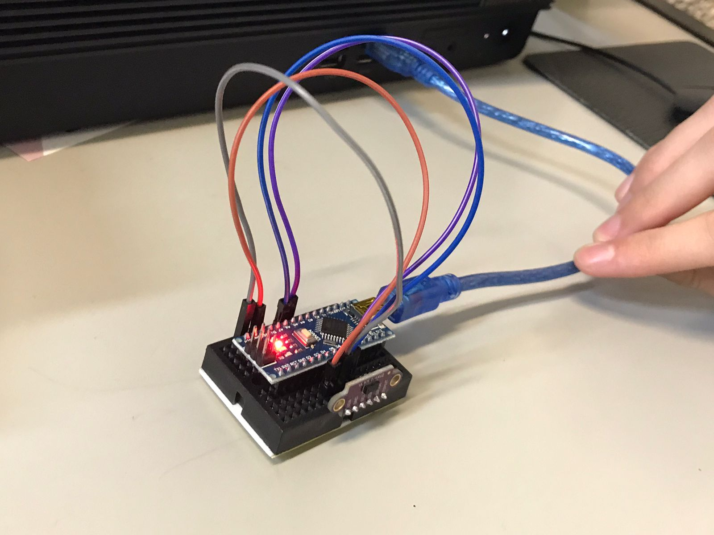
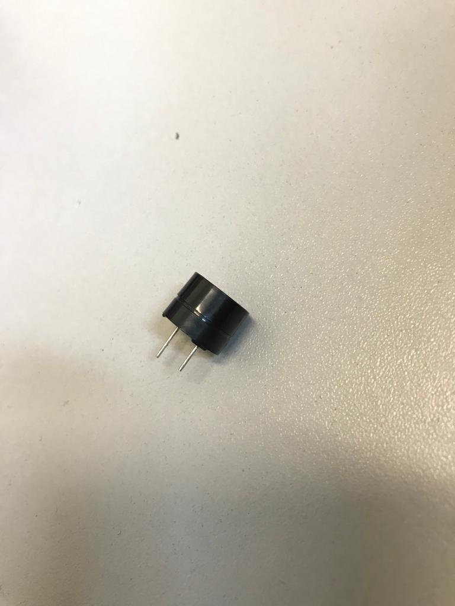
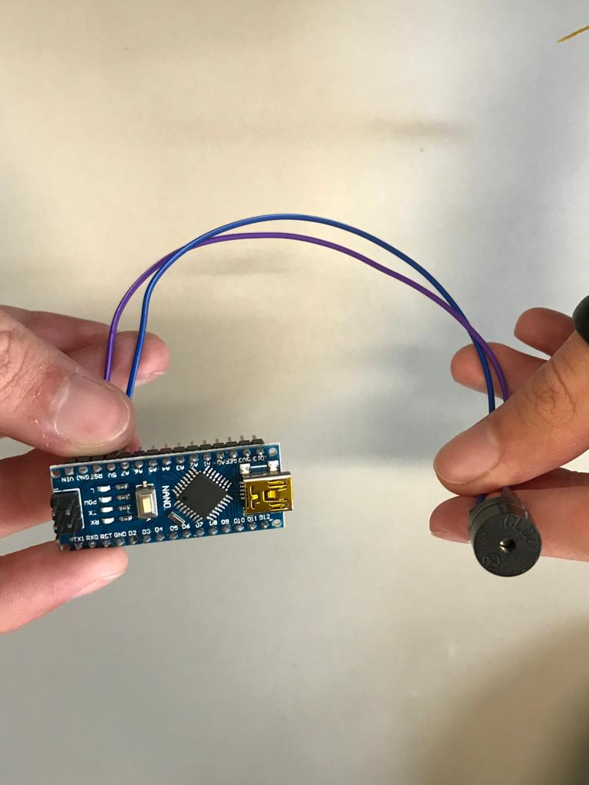

### Semana 23 - Do dia 01/08 ao dia 05/08
- Inicio de organização para montagem dos componentes;
- Continuação da pesquisa para compra do colete;
- Chegada do componente buzzer:
 
- Compra de um novo componente: mini ProtoBoard.

### Semana 24 - Do dia 08/08 ao dia 12/08
- Realização de teste do sensor de vibração;
- Verificação da funcionalidade de alguns componentes:
 

### Semana 25 - Do dia 15/08 ao dia 20/08
- Inicio da conexão de alguns componentes, junto a testes realizados com os mesmos:

### Semana 26 - Do dia 23/08 ao dia 28/08
- Correções do arquivo da bragantec;
- testes realizados com o sensor de distância.
