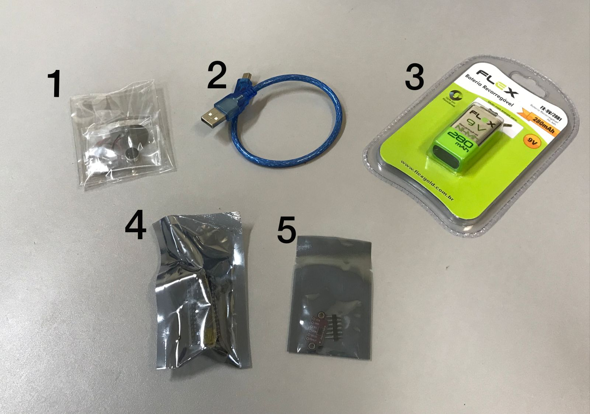

### Semana 22 - Do dia 04/07 ao dia 08/07
- Chegada de alguns dos primeiros componentes comprados.

### Semana 23 - Do dia 11/07 ao dia 15/07
- Realização de pesquisas especificas para a montagem de cada componente;
- chegada de outros componentes.

### Semana 24 - Do dia 18/07 ao dia 22/07
- Chegada do restante dos componentes:
 

### Semana 25 - Do dia 25/07 ao dia 29/07
- Pesquisa de um colete para compra e futura estruturação do projeto. 
