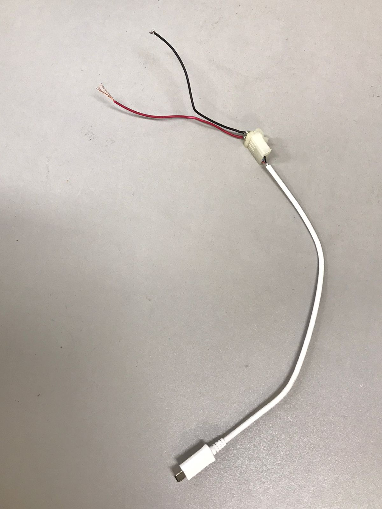

# Maio

---

### Semana 12 - Do dia 02/05 ao dia 06/05
- Compra dos componentes;
- Inicio da introdução do texto formal;
- Adaptação de cabo USB para teste:

 
 
 - Teste da adaptação do deck de bateria com ponta de micro USB pra conectar a um arduino nano.
 
 ### Semana 13 - Do dia 09/05 ao dia 13/05
 - Compra de alguns componentes do projeto;
 - Analise a respeito da compra de alguns componentes ja selecionados;

### Semana 14 - Do dia 16/05 ao dia 20/05
- Pesquisa de mais projetos relacionados ou que auxiliem na documentação do projeto;
- Termino da escrita da introdução;
- Alterações em alguns detalhes do site do projeto no Github;

### Semana 15 - Do dia 23/05 ao dia 27/05
- Inicio da escrita prévia da justificativa;
- Termino da escrita da justificativa;
- Compra do restante dos componentes;
