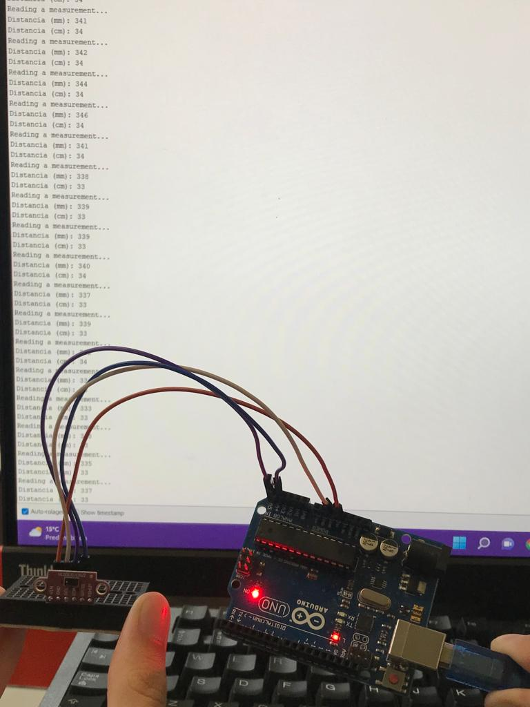
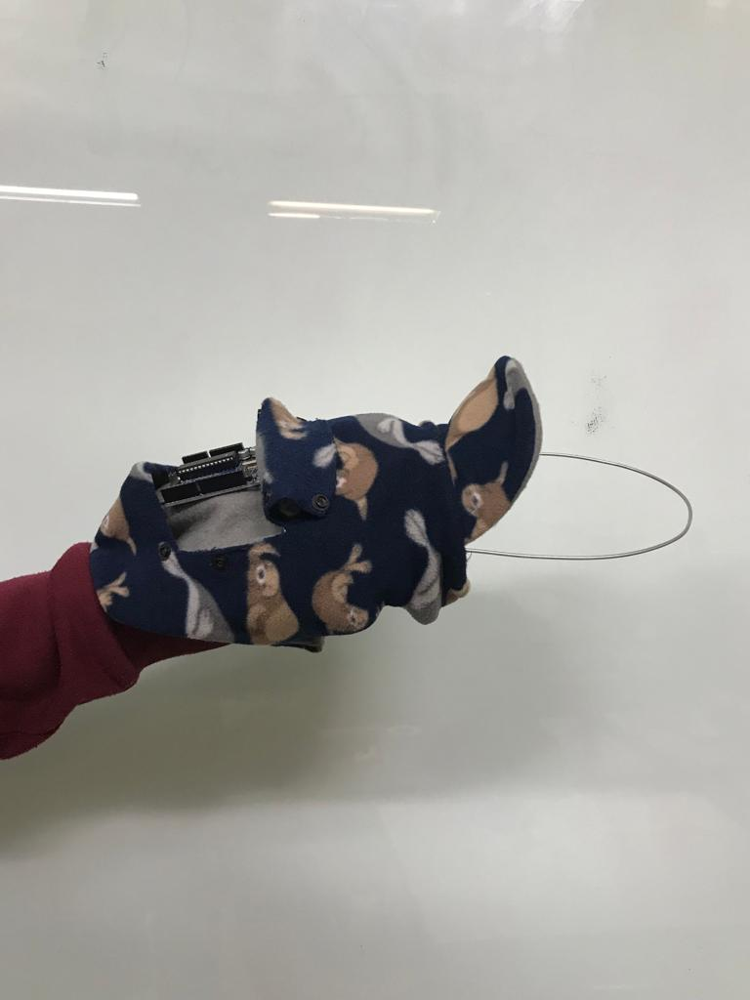
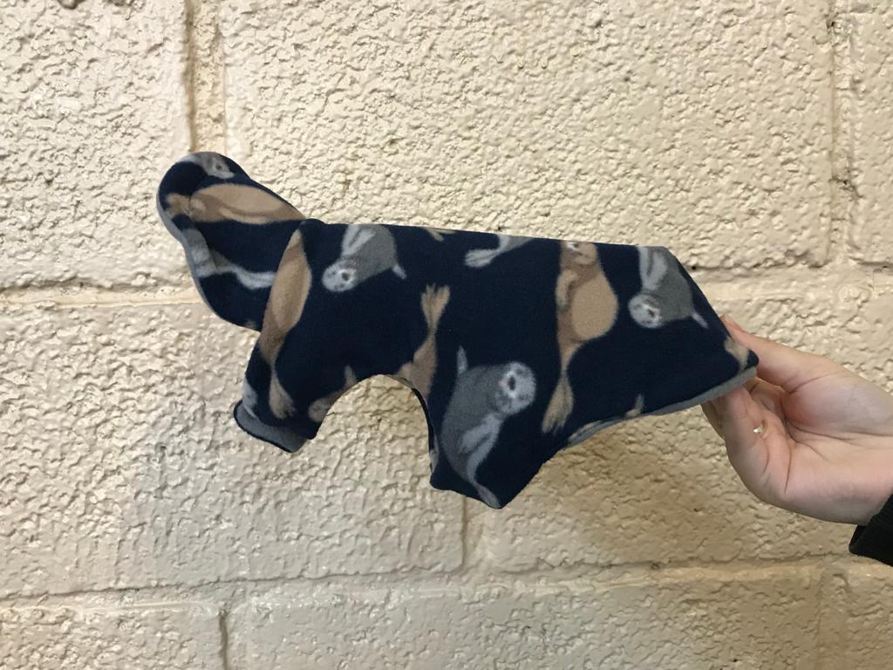

# Setembro
### Semana 27 - Do dia 29/08 ao dia 02/09
- Continuação da edição do arquivo com as informações do projeto;
- Inicio da produção da apresentação;
- Produção do Canvas:

- Finalização da logo:

### Semana 28 - Do dia 05/09 ao dia 09/09
- Apresentação;
- Teste final dos componentes:

### Semana 29 - Do dia 12/09 ao dia 16/09
- Compra da roupinha que será utilizada para a montagem do colete;
- Compra do arame que irá manter o colete fixo;
- Inicio de testes da junção dos componentes com a roupinha de diferentes formas;
 
 
- Inicio da produção do poster.

### Semana 30 - Do dia 19/09 ao dia 23/09
- Continuação da produção do banner;
- Inicio da criação de suporte com arame do colete;
 
 
- Término da pordução do poster e gravação de video com explicação do pojeto;
- Envio dos documentos para Bragantec.

### Semana 31 - Do dia 26/09 ao dia 30/09
- Preparação dos arquivos e gravação de video para a Feteps;
- Envio dos arquivos.
