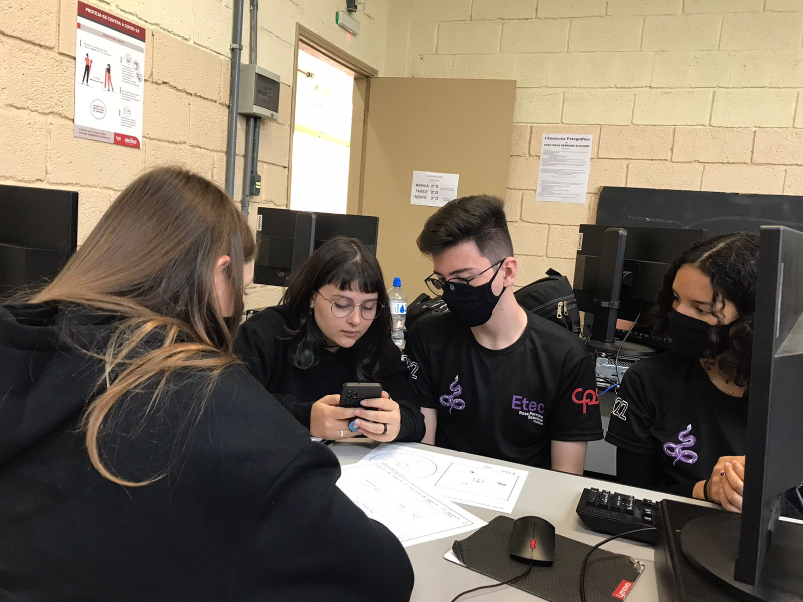
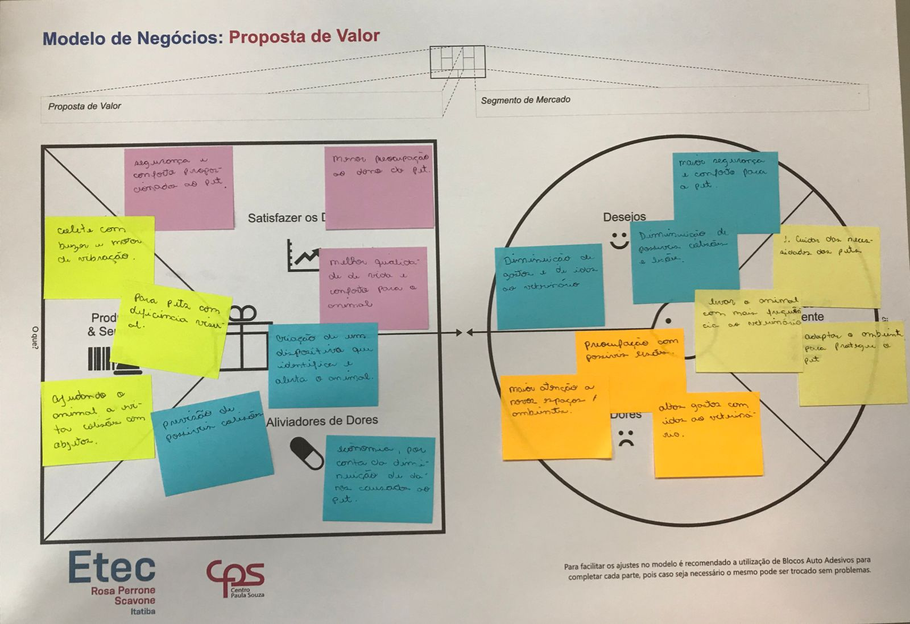
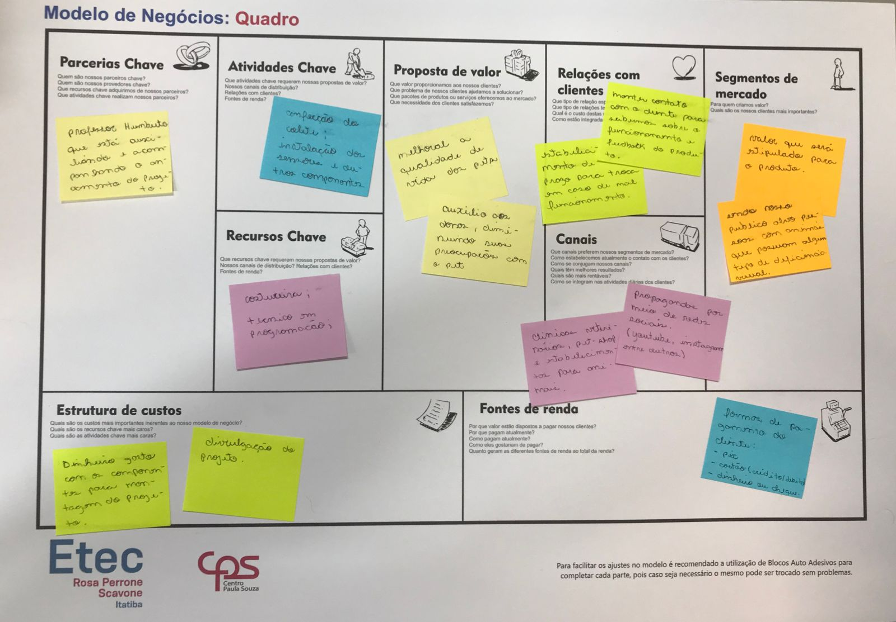
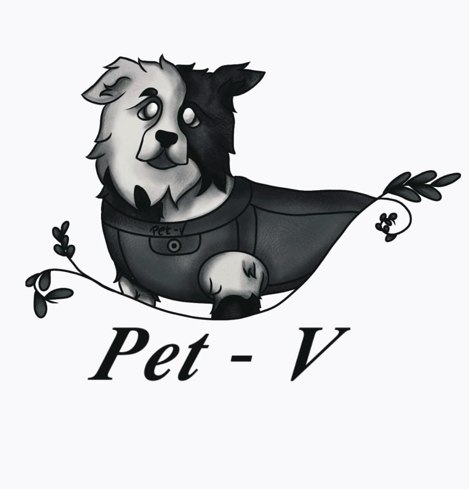

### Semana 27 - Do dia 29/08 ao dia 02/09
- Continuação da edição do arquivo com as informações do projeto;
- Inicio da produção da apresentação;
- Produção do Canvas:

- Finalização da logo:

### Semana 28 - Do dia 05/08 ao dia 09/09
- Apresentação;
- Teste final dos componentes:

### Semana 29 - Do dia 12/08 ao dia 16/09
- Compra da roupinha que será utilizada para a montagem do colete;
- Compra do arame que irá manter o colete fixo;
- Inicio da junção dos componentes com a roupinha;
- Inicio da produção do banner.
